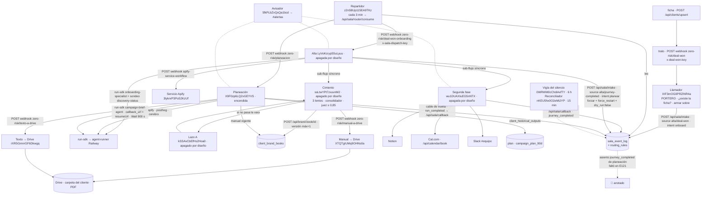

# 01 · ARQUITECTURA · el journey de alta y planeación

**Documento oficial · hito 2026-09-24 · escrito por CC#1 (encargo E123) · solo lectura · US$ 0.**
Reglas comunes: `zr-vault/raw/tasks/2026-09-08-SPRINT-planeacion-encargos/E122-HITO-reglas-comunes.md`.

Para quien no estuvo: este documento describe cómo funciona hoy el camino que va desde un trato cerrado hasta el plan de 90 días con su PDF. Cada afirmación lleva su fuente: un identificador de flujo, una ejecución del motor, un archivo del repositorio o un papel del archivo central. Lo que no pude verificar está marcado **desconocido**. Lo que está roto también se documenta. No hay credenciales aquí: sólo nombres de variables.

Cómo leer las fuentes:
- `flujo <id>` = un proceso operativo en el motor n8n (`https://n8n-production-72be.up.railway.app`), leído por su API el 2026-09-24.
- `ejecución <n>` = una corrida de ese motor, guardada como `raw/evidencia/<carpeta>/ejecucion-<n>.json` en el archivo central (`zr-vault`).
- `repo:<ruta>` = archivo del repositorio `zero-risk-platform` en `main` `4278889` (2026-09-24).
- `E107`, `E120B`, `E121` = las tres corridas completas sin manos; sus papeles viven en `zr-vault/raw/tasks/2026-09-08-SPRINT-planeacion-encargos/` (RESULTADO de CC#1 + CERTIFICACIÓN de CC#3) y su evidencia en `zr-vault/raw/evidencia/2026-09-21-E107-corrida-sin-manos-naufrago/`, `2026-09-24-E120B/` y `2026-09-24-E121/`.

Las tres corridas que respaldan este documento (todas con el cliente Náufrago, todas certificadas por CC#3):

| corrida | fecha | ficha | llamador | alta | cimiento | Lazo A | manual→Drive | fase 2 | planeación | plan→Drive | costo | duración |
|---|---|---|---|---|---|---|---|---|---|---|---|---|
| E107 | 2026-09-21 | `0736401b` | 146530 | 146532 | 146544 | – | 146548 | 146549 | 146562 | 146569 | US$ 2,80 | 31 min |
| E120B | 2026-09-24 | `058d06c4` (nueva) | 149687 | 149699 | 149710 | 149719 | 149723 | 149724 | 149727 | (dentro de 149727) | US$ 4,49 | 38 min 34 s |
| E121 | 2026-09-24 | `058d06c4` (existente · `force_restart:true`) | 150438 | 150440 | 150454 | – (juez a la primera) | 150458 | 150459 | 150473 | (dentro de 150473) | US$ 2,34 | 20 min 43 s |

Fuente: `README.md` de cada carpeta de evidencia · certificaciones `E107-CERTIFICACION-CC3-la-corrida-sin-manos.md`, `E120B-CERTIFICACION-CC3-la-corrida-sin-manos-con-ficha-minima.md`, `E121-CERTIFICACION-CC3-el-anclaje-no-falla-por-el-nombre.md`.

---

## 1 · Mapa de piezas

Estado leído en el motor el 2026-09-24 (78 flujos en total, 69 encendidos). **Encendido** = `active=true`. Las cuatro piezas pagas de la cadena están **apagadas por diseño** y sólo se encienden durante una corrida autorizada, en este orden: Lazo A → cimiento → segunda fase → alta; se apagan en orden inverso (fuente: `raw/evidencia/2026-09-24-E121/encender.sh` y `apagar-cadena.sh`; regla vigente desde E110).

| pieza | nombre en el motor | id | qué hace en una línea | estado |
|---|---|---|---|---|
| **Llamador del trato cerrado** | Zero Risk — Trato cerrado → sobre en la puerta (E57 · CC#2) | `IXF3mOG0PRZlNR4a` | Recibe el trato por webhook `zero-risk/deal-won`, verifica la llave (PORTERO), comprueba que la ficha del cliente exista (GUARDA E79) y deja el sobre en la puerta de la sala | **encendido** · v`76ef56ab` · 15 nodos · aviso de error → `5fkPLbZvQsQa1bcd` |
| **Sala · puerta** | (no es un flujo: es una ruta de la plataforma) | `POST /api/sala/intake` | Autentica el sobre por origen, lo anota en el libro `sala_event_log` y decide el tipo de viaje con la tabla `routing_rules` | ruta Vercel · `repo:src/app/api/sala/intake/route.ts` |
| **Repartidor (router)** | Zero Risk — Sala Router Consumer Cron (§150 · deal-won→onboarding · CC#3) | `z2nS8Up115EA9TKz` | Cada 3 minutos (`*/3 * * * *`) llama a `POST /api/sala/router/consume`, que lee los sobres pendientes y dispara el obrero por su webhook | **encendido** · v`4d3167dd` · 4 nodos |
| **Alta** | Zero Risk — Client Onboarding E2E v2 (Webhook: Deal Won) | `LyVoKcrypS5uLyuu` | Webhook `zero-risk/deal-won-onboarding`. Valida el trato, descubre al cliente con un agente, raspa competidores por el Servicio Apify, sintetiza el panorama, llama al cimiento y a la segunda fase, y pide la planeación a la sala | **apagado por diseño** · v`3fa98f7d` · 98 nodos · aviso de error → `5fkPLbZvQsQa1bcd` |
| **Cimiento** | Zero Risk — Brand Book · Cimiento Grading (sub-workflow productivo · CC#3 F2.2) | `ssLtwYPt7zxuvnM2` | Sub-flujo del alta. Tres lentes (agentes), consolidador, juez de fidelidad (vara 0,85), Lazo A si no pasa, promoción del manual a canon (versionado) y PDF a Drive | **apagado por diseño** · v`a0b67fad` · 30 nodos |
| **Lazo A** | Zero Risk — Brand Book · Lazo A corrección (sub-workflow) | `kSSAvCbEfHs2Hoa0` | Sub-flujo del cimiento. Un ciclo de corrección vía `run-sdk` cuando el juez no da la vara | **apagado por diseño** · v`d14f7279` · 12 nodos |
| **Segunda fase** | Zero Risk — Alta · Segunda Fase (Notion + Plan + Agenda + Cierre) | `wu1DUAXIuEG5nNTX` | Sub-flujo del alta. Espacio en Notion, plan de éxito, cita de kickoff en Cal.com, aviso en Slack, cierre (`run_completed`) y asiento `journey_completed` | **apagado por diseño** · v`38f7a01d` · 18 nodos |
| **Planeación** | Zero Risk — planeacion (esqueleto B0 · piezas se pegan en C2) | `X9F0zp6LQ2xGEYVS` | Webhook `zero-risk/planeacion`. Carga el manual vigente, tres brazos (Apify, PostHog, cerebro), redactor, guarda el plan, PDF a Drive, cable de vuelta a la sala | **encendido** · v`9a0fa6f7` · 40 nodos |
| **Servicio Apify** | Zero Risk — Apify Service Workflow (canonical · Sprint 9 P0) | `3lyknrP3PoS2KzUf` | Webhook `apify-service-workflow`. Un solo lugar que llama a los actores de Apify (Instagram, biblioteca de anuncios de Facebook, TikTok, LinkedIn, YouTube, Google) y guarda lo crudo | **encendido** · v`5e702294` · 57 nodos |
| **Manual → Drive** | Zero Risk — Manual de Marca → Drive (PDF) | `XTQTgIUMq9OHNs0a` | Webhook `zero-risk/manual-a-drive`. Pide el manual en limpio (`/api/brand-book/{id}/limpio`), lo sube a Drive como documento, lo exporta a PDF y lo mueve a la carpeta del cliente | **encendido** · v`6ea1eeed` · 16 nodos · credencial n8n `googleOAuth2Api` |
| **Texto → Drive** | Zero Risk — Texto → Drive (PDF) | `rXR5GmnrGF6Dkwgq` | Webhook `zero-risk/texto-a-drive`. Lo mismo que el anterior pero para un texto cualquiera (lo usa planeación para el plan) | **encendido** · v`33550568` · 16 nodos |
| **Avisador de errores** | Zero Risk — Aviso de error → #alertas (E73 · CC#1) | `5fkPLbZvQsQa1bcd` | Recibe los errores (errorTrigger o llamada directa «Nota perdida») y avisa al canal `#alertas` (`C0B7XUUEBHA`) | **encendido** · v`60fa116b` · 7 nodos |
| **Vigía del silencio** | Zero Risk — Vigía del silencio de la sala (E59 · CC#1) | `0WRWM0cChdiAxfTY` | Cada 6 horas (`0 */6 * * *`) mira el libro y el estado del repartidor; si la sala lleva más de `settings.sala.silencio_max_horas` sin asientos, avisa por Slack | **encendido** · v`d2014d36` · 10 nodos |
| **Reconciliador** | Zero Risk — Reconciliador execs waiting colgados (CC#3) | `nKEU5hx0O2eMtJYP` | Cada 15 minutos (`*/15 * * * *`) lista ejecuciones en `waiting` y avisa por Slack de las colgadas | **encendido** · v`c89dd36a` · 7 nodos |
| **Reloj del gasto Apify** | Zero Risk — Apify · anotar el gasto real (diario 05:00) | `jrnP5qTvEh0ACGkM` | Lee las corridas de Apify del día y anota el gasto real en la libreta `costs` | **encendido** · v`61de22fd` · 7 nodos |
| **Trigger de Cal.com** | Cal.com · Kickoff Booking Trigger | `DaNENCQSt5YomwpF` | Webhook `calcom-kickoff-booking` que recibe BOOKING_CREATED de Cal.com · 2 nodos · **qué hace después: desconocido** (no participó en E107/E120B/E121) | encendido · v`e7ef6a5b` |
| **Master Journey Orchestrator** | Zero Risk — MASTER JOURNEY ORCHESTRATOR (Nivel 1) | `ugK3QrxkWq22Bly5` | Lo lista el alta como sub-flujo («Trigger Master Journey ugK3»); escribe `client_journey_state`. **Si ese tramo corre hoy en la corrida real: desconocido** (no aparece en los asientos del libro de E120B/E121) | encendido · v`34dec103` · sin cambios desde 2026-05-23 |

Otros relojes encendidos que no forman parte del recorrido pero conviven en el mismo motor (sólo se nombran): Cost Watchdog `Gi2wq9baSRB3jQ0L` (cada hora), Agent Latency Monitor `g0ewNcSKHmgtWFgu` (cada 10 min), UptimeRobot → Slack `GwVId15UjYxqSn0Q` (cada 5 min), Pipeline Delay Resume `Laq2Zz2GtZBNZ1cy` (cada hora), Attribution Validator `f9cgFfI32GJlYZm0`, Incrementality Runner `9WN8ccqg1XPtTZ13`. Community Health Daily `1N06wMqgFdvL0t2j` está apagado.

**Regla de convivencia (vigente desde E113):** nadie publica nada, ni código ni flujos, mientras haya una corrida en curso, hasta que vuelva el cable de vuelta de planeación. Motivo: ver §4.4 (re-despliegue a mitad de corrida).

---

## 2 · El recorrido, paso a paso

Tiempos reales de E121 (ejecución 150440 y siguientes; `raw/evidencia/2026-09-24-E121/README.md` y `libro.json`). Los de E120B están en su `libro.json` y coinciden en forma.

**Paso 0 · la ficha existe antes del trato.** El llamador rechaza tratos de clientes sin ficha (`CLIENTE_INEXISTENTE`, guarda E79). Por eso las corridas crean o confirman la ficha con `POST /api/clients/upsert` antes de disparar (E120 falló justo por saltarse esto: papel `E120-RESULTADO-CC1-la-ultima-corrida-sin-manos.md`). La puerta devuelve `client_id`; si la ficha ya existía, devuelve la existente (E121: `058d06c4`, la de E120B).

**Paso 1 · el trato entra (llamador `IXF3mOG0PRZlNR4a`).** `POST /webhook/zero-risk/deal-won` con cabecera `x-deal-won-key`. PORTERO compara con `DEAL_WON_WEBHOOK_KEY`; si no coincide suma un rechazo en `settings.trato_cerrado.rechazos_portero` y falla. «¿El cliente existe?» lee `clients` por `id`. «Armar el sobre» construye la clave anti-repetidos: `deal_id` si viene; si no, cliente + fecha del trato (E75). «Dejar el sobre en la puerta de la sala» hace `POST /api/sala/intake`. Si la puerta rechaza, la corrida se detiene y avisa a `#alertas`. E121: ejecución 150438; sobre aceptado 15:46:14Z.

**Paso 2 · la sala anota y decide.** `intake` autentica por origen (tabla `ingress_sources`: `alta/deal-won` y `alta/journey-completed` son tier A con `x-api-key`; `ventas/deal-won` es tier B con firma HMAC), escribe un asiento `step_completed` en `sala_event_log` (E121: `intake.alta/deal-won.onboard` 15:46:14Z) y resuelve el tipo de viaje con `routing_rules`. Filas vivas hoy (leídas el 2026-09-24):

| source | intent | journey_type | obrero |
|---|---|---|---|
| `ventas/deal-won` | `onboard` | `ONBOARD` | `LyVoKcrypS5uLyuu` |
| `alta/deal-won` | `onboard` | `ONBOARD` | `LyVoKcrypS5uLyuu` |
| `alta/journey-completed` | `planear` | `PRODUCE` | `X9F0zp6LQ2xGEYVS` |

`intake` nunca dispara al obrero: eso lo hace el repartidor (regla de un solo repartidor, `repo:src/app/api/sala/intake/route.ts` cabecera). Nota declarada en el código: planeación viaja rotulada `PRODUCE` porque la taxonomía de viajes está cerrada (`repo:src/lib/sala-journey-dispatch/journey-workflow-map.ts`).

**Paso 3 · el repartidor dispara al alta.** El reloj `z2nS8Up115EA9TKz` corre cada 3 minutos y llama a `POST /api/sala/router/consume` con `x-api-key: INTERNAL_API_KEY`. El repartidor (`repo:src/lib/sala-journey-dispatch/workflow-dispatcher.ts`) arma `{base}/webhook/{webhook_path}` y hace POST con cabecera `x-sala-dispatch-key: SALA_DISPATCH_KEY`; sin esa variable no dispara (fail-closed, E67). El cuerpo lleva `business_payload` (el trato tal cual) más `_sala_correlation_id`, `_journey_id`, `_sala_*`; el obrero los desenvuelve. Asiento: `router.dispatch.alta/deal-won.onboard` (E121 15:48:02Z, es decir hasta 3 minutos de espera). **Por eso el alta tiene que estar encendida antes de que el reloj pase**: si el webhook no está registrado, el despacho falla.

**Paso 4 · el alta (`LyVoKcrypS5uLyuu`, E121 ejecución 150440, 10 min 55 s).** En orden:
1. «Webhook: Deal Won» (`responseMode: responseNode`) → «Validate Deal Data» (exige `client_name`; genera `client_id` si no viene; aplica valores por defecto y los declara en `_defaults_aplicados`: `industry`, `contract_scope`, `location`) → asiento `INTAKE` (15:48:03Z).
2. «Call Onboarding Specialist: Auto-Discovery Dispatch (fire+forget)» → `POST /api/agents/run-sdk` con el agente `onboarding-specialist`; el alta **sondea** `GET /api/onboarding/discovery-status/{clientId}` cada 20 s («Poll · Wait 20s», «Poll · Ready?», «Poll · Retry Guard», «Poll · Timeout»). Motivo del sondeo, escrito en la ruta: la vuelta asíncrona de Vercel no sobrevivía a corridas largas (`repo:src/app/api/onboarding/discovery-status/[clientId]/route.ts`). E121: descubridor terminado 15:51:43Z (US$ 0,36), asiento `DISCOVERY`. Ventana ciega conocida: el sondeo dice «listo» antes de que exista la lista de competidores (memoria `project-ventana-ciega-entre-listo-y-la-lista-de-competidores`).
3. «Persist Client to Supabase» → `POST /api/clients/upsert`. Desde E121 no manda `industry: unknown` cuando fue valor por defecto, para no pisar lo que escribió el poblador del descubrimiento (`repo:scripts/worker-staging/LyVoKcrypS5uLyuu/construir-e121.mjs`).
4. Veredicto de competidores: «Confirm barato · competitor list» → «Competitor Verdict · run-sdk (INLINE)» → «IF · veredicto». Si pide otra vuelta: rama `[RD]` (re-descubrimiento con reintentos), `[ANCHOR] Load client` (`GET /api/clients?client_id=…`, por id desde E121) → `[ANCHOR] Guard geo+canonical` → `[APIFY] Scrape-Verify` (`POST /api/competitors/scrape-verify`) → `[APIFY] Enrich competitors` → re-gate. En E120B (149699) esta rama corrió y el anclaje falló por buscar por nombre (409 `client_name_ambiguous`, 3 fichas); en E121 (150440) el veredicto fue directo y la rama no corrió: el anclaje por id sólo está probado en el motor a costo cero (150388, 8/8). Fuente: `E121-RESULTADO-CC1-el-anclaje-no-falla-por-el-nombre.md` y `raw/evidencia/2026-09-24-E121/paso0.md`.
5. Lazo de raspado: «[APIFY-WIRE] Discovery Parser · dynamic targets» → «Split per scrape target» → «Gate · drop skip-markers» → «Call Apify Service Workflow» (`POST /webhook/apify-service-workflow`, flujo `3lyknrP3PoS2KzUf`) → «Aggregate». E121: 10 objetivos → 9 tras la compuerta → 9/9 ok (Instagram propio ×2, 4 bibliotecas de anuncios, 3 Instagram de competidores). Asiento `APIFY_WIRE` (llega al final, 15:58:56Z).
6. «Synthesis Staging · build package» → «[JEFATURA] Load landscape_summary (canon)» (lee `client_competitive_landscape` con `competitor_name=_landscape_summary`) → «Leer el sitio del cliente (materia prima)» → «[JEFATURA] Transform discovery→package» → «[JEFATURA] Execute Cimiento Track» (sub-flujo `ssLtwYPt7zxuvnM2`, síncrono: el alta espera el resultado).
7. «IF track_pass (¿el cimiento pasó de verdad?)» → asiento `CIMIENTO_PROMOTED` (15:58:38Z) o `cimiento.failed` + «Stop and Error».
8. «Armar carga · segunda fase» (11 datos; `contact_email: v.contact_email || v.email`, E118) → «Llamar · Segunda Fase del alta» (sub-flujo `wu1DUAXIuEG5nNTX`).
9. «E57 · sobre · pedir planeación a la sala» → `POST /api/sala/intake` con `source: alta/journey-completed`, `intent: planear` (§3.4). Asiento `intake.alta/journey-completed.planear` (15:58:55Z). Si la puerta rechaza: «GUARDA · si la puerta rechazó el pedido de planeación» detiene.

**Paso 5 · el cimiento (`ssLtwYPt7zxuvnM2`, E121 ejecución 150454).** «[BB] Fan-out prep» → tres lentes en paralelo (`brand-strategist`, `editor-en-jefe`, `jefe-client-success`, cada uno por `run-sdk`) → «Merge lentes (esperar 3)» → «Rescate» (si falta una lente, lee lo ya pagado en `agent_invocations` y fusiona o para) → «Consolidador» → «Judge prep» (recorta la materia: bloque ≤ 3 500 + 1 000 caracteres, tope 14 000; E110) → «Judge · run-sdk» + «Faithfulness judge» (vara 0,85 en `positioning` e `icp`; E121: 0,94 / 0,98 / 0,95 a la primera). Si no pasa: «Lazo A prep» → «Execute Lazo A corrección» (sub-flujo `kSSAvCbEfHs2Hoa0`, una llamada a `run-sdk`) y vuelve al juez; «ciclos agotados» → «HITL último recurso» (`POST /api/hitl/queue`). Si pasa: «Guardia de procedencia» (sólo promueve si lo invocó el padre; candado C1) → «Promote → canon» → `POST /api/brand-book/{clientId}` (inserta versión = máx + 1; E111) → «Manual → Drive (PDF)» (`POST /webhook/zero-risk/manual-a-drive`, flujo `XTQTgIUMq9OHNs0a`, ejecución aparte: E121 150458). E121: manual v2 `f32e6af9`, `gate_outcome: paso_la_vara`, la v1 `9889214b` de E120B se conserva (leído en `client_brand_books` el 2026-09-24).

**Paso 6 · la segunda fase (`wu1DUAXIuEG5nNTX`, E121 ejecución 150459).** «Create Notion Client Workspace» (`POST /api/notion/create-client-workspace`) → asiento `WORKSPACE` · «Build Success Plan Template» → «Create Success Plan in Notion» → `success_plan_built` · «Schedule Kickoff Call (Cal.com)» (`POST /api/calendar/book`) → asiento `SCHEDULING` sólo si la reserva volvió con `ok` y `booking.id` (E118); si no, el libro queda en `started` · «Alert Slack: Onboarding Initiated» con la línea «Kickoff: AGENDADO · fecha · enlace» o «NO AGENDADO · motivo» · «[MODELB] Write-back Callback · run terminal» → `POST` a `SALA_CALLBACK_URL` con `event_type: run_completed`, `worker_id: LyVoKcrypS5uLyuu` · «Phase-boundary Emit · journey_completed» → asiento `journey_completed` (15:58:49Z). Cada emisión tiene su «Nota perdida» que, si el asiento no se pudo escribir, avisa por el avisador `5fkPLbZvQsQa1bcd`. E121: Notion creado, Cal.com `uR7UPsckaw7cQrCaGd5Zum` (28-sep 14:30Z, `confirmed`).

**Paso 7 · el repartidor dispara la planeación.** Mismo reloj de 3 minutos. Asiento `router.dispatch.alta/journey-completed.planear` (E121 16:00:08Z).

**Paso 8 · planeación (`X9F0zp6LQ2xGEYVS`, E121 ejecución 150473).** «Webhook · planeacion» (`responseMode: onReceived`: contesta 200 de inmediato y sigue sola) → «① Cargar el manual de marca» (`client_brand_books` por `client_id`, `order=version.desc&limit=1`; E112) → «① GUARDA · sin manual aprobado se DETIENE» → «Ficha del cliente» → «② GUARDA · sin referencia del producto se DETIENE» → «⑥ ¿Ya tiene un plan?» (busca en `agent_invocations` un `campaign-brief-agent` completado) → «⑥ IF · ¿corrida repetida?»: si ya hay plan y **no** viene `forzar`, no corre, avisa a `#alertas` y devuelve el cable «no_corrio_repetida» · «elegir brazos» → «Brazo · Apify», «Brazo · PostHog», «Brazo · cerebro» (`POST /api/planeacion/brazo/{apify|posthog|cerebro}`) → «Junta · esperar los 3 brazos» → «Competidores del cliente» → «Derivador (B5)» → «Redactor (B4)» arma el pedido (tuteo desde E116) → «Pedir el plan al redactor»: `POST /api/agents/run-sdk` con `agent: campaign-brief-agent`, `callback_url: $execution.resumeUrl`, `force_restart` del sobre → «Esperar al redactor» (Wait, reanudación por webhook, tope 900 s) → «¿Llegó la vuelta?» distingue vuelta real de espera agotada (12-sep: un plan de 341 s se perdió con un tope de 290 s) → «Guardar el plan» (`client_historical_outputs`, `output_type: campaign_plan_90d`, `status: draft`, `provenance_tag.guardado_antes_de_drive: true`) → «Plan → Drive (PDF)» (`POST /webhook/zero-risk/texto-a-drive`, flujo `rXR5GmnrGF6Dkwgq`) → «¿Salió el PDF?» / «Campana · plan sin PDF» → «Cable de vuelta · sala». E121: redactor US$ 0,35 en 329 s, plan `4a6cff12` (20 654 caracteres), PDF `1fcUfZs6PTiZKfBmZ-xY8uH0I_b4gYEjL`, cable 16:06:52Z.

**Paso 9 · el cable de vuelta.** «Cable de vuelta · sala» hace `POST` a `SALA_CALLBACK_URL` (la ruta `POST /api/sala/callback`) con `event_type: run_completed`, `worker_id: X9F0zp6LQ2xGEYVS`, `worker_name: planeacion`, `resultado: plan_terminado | no_corrio_repetida`, `client_id`, `tenant_id`, `_sala_correlation_id`, `_journey_id`, `ts`. La ruta escribe un asiento `journey_completed` con `step_state: done` y `stream_id = _journey_id` (`repo:src/app/api/sala/callback/route.ts`). «Cable · ¿volvió?» falla ruidoso (`CABLE_DE_VUELTA_MUDO`) sólo si la sala lo despachó (hay `_sala_correlation_id`) y la respuesta no fue `ok:true`. Es la señal de fin de corrida: sólo después de este asiento se apaga la cadena y se puede volver a publicar.

🔴 **Lo roto, documentado:** en E121 el cable devolvió `vuelta_ok:true` con un `event_id`, pero `sala_event_log` **no tiene** el asiento `journey_completed` de planeación (termina en `router.dispatch…planear` 16:00:08Z; `raw/evidencia/2026-09-24-E121/libro.json`). E120B sí lo tuvo (03:35:47Z). CC#3 lo confirmó en su certificación y lo llamó «la enfermedad de E107». Causa: **desconocida** (se investiga aparte; candidatos declarados: la base, que venía de caerse, o el cable).

**Cómo se entera cada uno de que el anterior terminó:**

| tramo | mecanismo |
|---|---|
| llamador → sala | respuesta HTTP síncrona de `intake` (`accepted` / `duplicate`); si no, la corrida falla |
| sala → alta / planeación | el reloj de 3 min del repartidor dispara el webhook; el obrero contesta 200 |
| alta → descubridor | sondeo cada 20 s a `discovery-status` |
| alta → Servicio Apify | HTTP síncrono al webhook (`respondToWebhook`) |
| alta → cimiento → Lazo A / segunda fase | sub-flujo síncrono (`executeWorkflow`); el padre espera |
| cimiento / planeación → Drive | HTTP al webhook con `responseMode: onReceived` (fire and forget) |
| planeación → redactor | Wait + `callback_url = $execution.resumeUrl`; el runner reanuda con la respuesta |
| obreros → sala | asientos `phase_boundary` en `POST /api/sala/ingress` (`started` / `completed`) y `run_completed` en `POST /api/sala/callback` |

---

## 3 · Los sobres

**3.1 · El trato (lo que recibe el llamador).** Cuerpo real enviado en E121 (`raw/evidencia/2026-09-24-E121/trato-enviado.json`, llave fuera): `deal_id`, `closed_at`, `client_id`, `tenant_id`, `client_name`, `website`, `instagram`, `instagram_handle`, `email`, `contact_name`, `country`, `language`, `contract_scope`, `deal_value`, `dry_run`, `force_restart`, `_meta`.
- Obligatorios de verdad: `client_name` (el validador del alta lanza error sin él) y una ficha existente para `client_id` (guarda E79). `deal_id` es opcional pero sin él la clave anti-repetidos es cliente + fecha, y dos tratos del mismo cliente el mismo día colapsan en uno (declarado en «Armar el sobre», E75).
- `industry`, `location`, `contract_scope` son opcionales: el validador pone valores por defecto y los declara en `_defaults_aplicados`.
- Cabecera: `x-deal-won-key`.

**3.2 · El sobre de la sala (`IngressEnvelope`, `repo:src/app/api/sala/intake/route.ts`).** `source`, `intent`, `payload` (opaco), `idempotency_key`, `logical_period`, `tenant_id`, `client_id`, `correlation_id` (UUID, opcional), `stream_id` (opcional). Respuesta siempre 200 con `kind: accepted | duplicate` (503 si la puerta está apagada por `SALA_INTAKE_ENABLED`). `duplicate` **no es error**: el llamador avisa cuando no había identificador (E75).

**3.3 · Lo que el repartidor le entrega al obrero.** `business_payload` (el `payload` del sobre) + `_sala_correlation_id` + `_journey_id` + campos `_sala_*`; el obrero no puede secuestrar los `_sala_*` porque los pone el repartidor, no el origen (`repo:src/lib/sala-journey-dispatch/workflow-dispatcher.ts`). Cabecera `x-sala-dispatch-key`.

**3.4 · El sobre de planeación (nodo «E57 · sobre · pedir planeación a la sala» del alta, leído en v`3fa98f7d`).**
```json
{ "source": "alta/journey-completed", "intent": "planear",
  "payload": { "pedido": "plan de 90 dias", "dry_run": false,
               "forzar": "<force_restart del trato>", "force_restart": "<force_restart del trato>",
               "client_id": "<id>", "desde_worker": "LyVoKcrypS5uLyuu", "journey_id": "<_journey_id>" },
  "idempotency_key": "<_journey_id>:planear", "logical_period": "alta:<_journey_id>",
  "tenant_id": "<tenant_id || client_id>", "client_id": "<id>", "correlation_id": "<_sala_correlation_id>" }
```

**3.5 · Los cuatro campos que costaron sangre.**
- **`dry_run`.** Para `run-sdk` significa «no llames al modelo, devuelve una respuesta canónica falsa, costo cero» (`repo:src/app/api/agents/run-sdk/route.ts`, comentario del tipo del cuerpo). Para el Servicio Apify significa ensayo, y en ensayo cinco funciones devuelven datos inventados sin marcarlos (memoria `project-el-ensayo-de-apify-devuelve-datos-inventados`). El sobre de planeación lo fija en `false`. Regla de cierre: ningún hito se cierra con `dry_run` (CLAUDE.md §16, regla Q1).
- **`force_restart` / `forzar`.** Son dos nombres del mismo deseo y viajan juntos desde E111. `force_restart` lo lee `run-sdk` para saltarse el checkpoint: sin él, un agente ya corrido para ese cliente devuelve la primera respuesta guardada en 0,7 s y US$ 0, sin fila nueva (memoria `project-el-flujo-de-prueba-devuelve-respuestas-viejas`). `forzar` lo lee la guardia ⑥ de planeación para aceptar una corrida repetida. En E121 el trato llevó `force_restart: true` porque la ficha ya existía, y por eso el descubridor volvió a correr, el manual salió como v2 y el plan se rehizo (`raw/evidencia/2026-09-24-E121/disparar.cjs`).
- **`client_id`.** Es la clave de todo: `clients.id`. Si el trato no lo trae, el validador genera un UUID nuevo, y entonces el llamador lo rechaza porque esa ficha no existe (E120). La búsqueda por nombre es ambigua desde que hay lápidas (tres filas «Náufrago» hoy: dos `churned` con slug `naufrago-borrado-…` y una activa `058d06c4`; leído el 2026-09-24), por eso el anclaje pregunta por id desde E121. La reserva de Cal.com todavía nace con `client_id: null` (§5).
- **`email` vs `contact_email`.** El trato trae `email`; la ruta de reserva exige `contact_email`. Desde E118 «Armar carga · segunda fase» pone `contact_email: v.contact_email || v.email` y la reserva acepta los dos. Antes de E118 la cita no se agendaba (papel `E118-RESULTADO-CC1-la-cita-se-agenda-y-el-libro-no-miente.md`).

**3.6 · El pedido a `run-sdk`.** `agent` (slug), `task`, `client_id` (activa el cerebro), `workflow_id` y `workflow_execution_id` (obligatorio el primero: sin contexto de flujo la ruta rechaza; canon «agentes sólo vía flujos»), `resume_session_id`, `pipeline_id`, `step_name`, `force_restart`, `dry_run`, `callback_url` / `callbackUrl` (arriba o dentro de `context`), `extra`. Fuente: cabecera y tipo del cuerpo en `repo:src/app/api/agents/run-sdk/route.ts`.

---

## 4 · Fuera de n8n

**4.1 · zero-risk-platform (Vercel · `https://zero-risk-platform.vercel.app`).** Puertas que usa el recorrido (todas con `x-api-key: INTERNAL_API_KEY` salvo que se diga otra cosa):

| puerta | para qué | quién la llama |
|---|---|---|
| `POST /api/clients/upsert` | crear o encontrar la ficha; sólo `name` es obligatorio; descarta `contact_email` e `instagram` (E120B) | quien dispara la corrida · alta «Persist Client» |
| `GET /api/clients?client_id=…` | leer la ficha por id (por `name` devuelve 409 si hay homónimas) | alta «[ANCHOR] Load client» |
| `POST /api/sala/intake` | dejar un sobre (§3.2) | llamador · alta (E57) |
| `POST /api/sala/router/consume` | un tic del repartidor | reloj `z2nS8Up115EA9TKz` |
| `POST /api/sala/ingress` | asientos `phase_boundary` (`started`/`completed`) | alta · segunda fase |
| `POST /api/sala/callback` | `run_completed` → asiento `journey_completed` | segunda fase · planeación |
| `POST /api/agents/run-sdk` | pedir trabajo a un agente (§4.3) | alta · cimiento · Lazo A · planeación |
| `GET /api/onboarding/discovery-status/{clientId}` | ¿terminó el descubridor? | alta (sondeo) |
| `POST /api/competitors/scrape-verify` | verificar competidores raspando | alta `[APIFY] Scrape-Verify` |
| `POST /api/brand-book/{clientId}` · `GET …` · `GET …/limpio` | guardar el manual como versión nueva · leerlo · versión limpia para el PDF | cimiento · Manual → Drive |
| `POST /api/notion/create-client-workspace` · `POST /api/notion/create-success-plan` | espacio y plan de éxito en Notion | segunda fase |
| `POST /api/calendar/book` | reserva real en Cal.com Cloud (`api.cal.com/v2/bookings`); exige `contact_email` y `scheduled_at` | segunda fase |
| `POST /api/planeacion/brazo/{apify,posthog,cerebro}` | los tres brazos de planeación | planeación |
| `POST /api/hitl/queue` | último recurso humano | cimiento · alta |
| `GET /api/client-brain/{client_id}` | lector del cerebro · 🔴 **roto**: pide columnas que no existen (E115, `E115-RESULTADO-CC2`) | Master Journey `ugK3` |

Frenos en la plataforma: `checkRunSdkSpendCap` (`repo:src/lib/run-sdk-spend-gate.ts`) con alerta cuando el freno se degrada (`repo:src/lib/spend-gate-alert.ts`; variables `SALA_NAUFRAGO_CAP_USD`, `SALA_NAUFRAGO_RUN_CAP_ENFORCE`). Pendiente declarado: fail-open vs fail-closed (memoria `project-spend-gate-generic-backlog`).

**4.2 · agent-runner (Railway · `https://zero-risk-platform-production.up.railway.app`).** Servicio Express en `repo:services/agent-runner/`. Rutas: `GET /`, `GET /health` (devuelve el uptime), `POST /run-sdk`. Existe porque el SDK de agentes trae un binario nativo de 220 MB que Vercel no empaqueta (cabecera de `run-sdk/route.ts`). Cómo se le pide trabajo: Vercel reenvía el cuerpo de `run-sdk` con la misma cabecera `x-api-key` (`INTERNAL_API_KEY`); el runner exige `agentName | agent | agent_name` y `task` (400 si faltan; 401 sin llave). Qué hace: carga la identidad del agente, enriquece con el cerebro (`repo:services/agent-runner/src/lib/brain-enrichment.ts`: consulta ≤ 6 000 caracteres, sólo trozos del manual vigente, campos `brain_query_chars`, `brain_query_truncated`, `brain_chunks_old_version_dropped`, `brain_manual_vigente_id`; E114/E116), corre el agente, y en el descubridor fuerza la emisión estructurada `emit_discovery_output` (7 campos: `client_id`, `own_handles`, `competitors`, `icp`, `competitive_landscape_summary`, `client_industry`, `client_markets`; los tres primeros obligatorios; `repo:services/agent-runner/src/lib/forced-emit-messages.ts`). Cómo contesta: respuesta síncrona a Vercel con `success`, `response`, `session_id`, costo y `metadata`; Vercel persiste en `agent_invocations` y, si había `callback_url`, hace el POST de reanudación (`repo:src/lib/agent-async-callback/index.ts`, intentos en `agent_callback_attempts`). Registro legible de fallos: Braintrust (memoria `project-braintrust-es-el-canal-legible-de-errores-de-agente`); Sentry sin llave.

**4.3 · run-sdk, en una línea por comportamiento.** Valida y sanea; exige `workflow_id`; aplica el freno de gasto; si `dry_run` devuelve respuesta canónica sin costo; si no hay `force_restart` y ya existe checkpoint para ese agente y cliente, devuelve la respuesta guardada; si no, reenvía al runner; escribe `agent_invocations` y `agent_dispatches`; si hay `callback_url`, reanuda el flujo que espera. El recibo incluye desde E121 `config_industry_outcome` y `config_market_outcome` (qué hizo el poblador con el rubro y las ciudades).

**4.4 · Qué pasa si se re-despliega a mitad de una corrida.** El runner se re-despliega en cada publicación a `main` (Railway con `Dockerfile`, `healthcheckPath: /health`, 1 réplica, `repo:services/agent-runner/railway.json`; CI en `repo:.github/workflows/ci.yml` corre en push y pull request a `main`). Con una réplica, el despliegue reemplaza el proceso: la petición en vuelo muere. Medido: el 12-sep un reinicio del corredor devolvió 502 a los 301,7 s y el plan se perdió (comentario del nodo «¿Llegó la vuelta?» de planeación); en E112 parte B la planeación forzada murió en el redactor a los 95 s con `agent-runner upstream failed` sin fila en `agent_invocations` (`E112-RESULTADO-CC1-el-cerebro-lee-la-vigente-y-naufrago-al-dia.md`). Vercel también se re-despliega con cada `main`, y un despliegue en vuelo puede cambiar las rutas que los flujos están llamando. Por eso la regla: **cero despliegues en vuelo antes de disparar y nadie publica hasta que vuelva el cable** (E113). Señal de que hubo despliegue: el uptime de `/health` vuelve a cero (los tokens de Railway del entorno están inválidos, `Not Authorized`; E121).

---

## 5 · Dónde vive cada cosa

Base: proyecto Supabase `ordaeyxvvvdqsznsecjx` (compartido con la landing, §7). Conteos leídos el 2026-09-24 con `Prefer: count=exact`.

| qué | dónde | filas hoy | ¿se borra? |
|---|---|---|---|
| **ficha del cliente** | `clients` (`id`, `name`, `slug`, `status`, `archived_at`, `industry`, `market`, `config` con `config.apify.competitor_list`) | 7 | Se «borra» con lápida: `status: churned`, `archived_at`, slug `…-borrado-<fecha>` (E119: Náufrago tiene dos lápidas y una ficha viva). Las lápidas no se tocan |
| **manual de marca y sus versiones** | `client_brand_books` (`version`, `gate_outcome`, `created_at`; la vigente es la de mayor `version`) | 2 (v1 y v2 de `058d06c4`) | Sólo añadir: cada promoción inserta versión = máx + 1 (E111, `repo:src/app/api/brand-book/[clientId]/route.ts`). No hay restricción de una fila por cliente (verificado en E111) |
| **cerebro (RAG)** | `client_brain_chunks` (trozos con `source_table`, `source_id`, `provenance_tag`) · `client_web_pages` · costos de huellas en `brain_embed_costs` | 110 · 1 · 51 | Se re-embeben; los trozos de manuales viejos conviven con los nuevos y el lector los filtra por versión vigente (E116) |
| **panorama competitivo** | `client_competitive_landscape` (una fila por competidor + una `_landscape_summary`) · crudo de Apify en `apify_raw` | 14 · 60 | E121: 14 filas con `client_id`. **Borrable: desconocido** (E119 borró filas del cliente; regla general no escrita) |
| **ICP** | `client_icp_documents` | 6 | desconocido |
| **planes** | `client_historical_outputs` (`output_type: campaign_plan_90d`, `status: draft`, `provenance_tag`) | 2 | Se guarda antes de Drive; borrable como el cliente (E119) |
| **libro de la sala** | `sala_event_log` (`event_type`, `step_id`, `step_state`, `stream_id`, `journey_type`, `tenant_id`, `client_id`, `occurred_at`) | 23 | **Sólo añadir** (es el libro). Retención: **desconocido** |
| **rutas de la sala** | `routing_rules` · `ingress_sources` | 3 · 3 | configuración |
| **invocaciones de agentes** | `agent_invocations` (`agent_name`, `cost_usd`, `status`, `duration_ms`, `metadata`, `workflow_execution_id`) · `agent_dispatches` · `agents_log` · intentos de vuelta en `agent_callback_attempts` | 185 · 5 · 1 573 | Historial. Ojo: en los fire+forget `workflow_id` guarda un UUID de despacho; correlacionar por `workflow_execution_id` (memoria `project-agent-invocations-workflow-id-es-execution-id`) |
| **checkpoints** | `workflow_checkpoints` | 19 | Se **sobrescribe** por cliente (memoria `project-historial-de-agentes-vive-en-agent-invocations`) |
| **libreta de costos** | `costs` (Apify diario por el reloj `jrnP5qTvEh0ACGkM`; 4 categorías permitidas, 2 decimales) | 187 | **Sólo añadir, nunca se borra** (decisión de Emilio, E120) |
| **cola humana** | `hitl_approvals` | 0 (tabla responde 200 sin filas) | 🔴 el lector `/api/hitl/approvals/pending` devuelve filas caducadas como pendientes (memoria `project-hitl-pending-endpoint-lectura-congelada`) |
| **reservas** | `calendar_bookings` · `calendar_booking_attempts` | 2 · 7 | 🔴 nacen con `client_id: null`; la cancelación en Cal.com no vuelve a la fila (E118) |
| **estado del viaje (viejo)** | `client_journey_state` (lo escribe el Master Journey `ugK3`) | 4 | desconocido |
| **ajustes** | `settings` (`trato_cerrado.rechazos_portero`, `sala.silencio_max_horas`, `planeacion.porcentaje_de_la_casa`) | 3 | configuración |

**Google Drive.** Carpeta madre `1WRmkLvj5CMdbohf4T2INsG0hn5Ebl88d` (id fijo en los flujos Texto → Drive y Manual → Drive); dentro, una carpeta por cliente con su nombre (E120B creó `1KzDkQ5LPDTukKXtW_l6_bcg3BPtnZ660` «Náufrago»). Dentro van el manual en PDF (E121 `18276o_6KuXHUaTtr3q8CPkvgKapIXOOp`) y el plan en PDF (E121 `1fcUfZs6PTiZKfBmZ-xY8uH0I_b4gYEjL`). El documento intermedio se convierte y se mueve; los PDF son borrables (E119 mapeó 8 PDF y 9 temporales). Autenticación: credencial OAuth de n8n «Google account» en `XTQTgIUMq9OHNs0a`; en `rXR5GmnrGF6Dkwgq`: **desconocido** cómo se autentica (no lista credencial n8n ni `$env`; no lo abrí más). Esa credencial caducó en julio y hubo que reconectarla (memoria `project-credencial-google-de-n8n-caducada`).

**Notion.** Espacio del cliente y plan de éxito bajo `NOTION_PARENT_PAGE_ID`, vía las dos rutas de la plataforma (`NOTION_API_KEY`, `NOTION_CLIENTS_DATA_SOURCE_ID`, `NOTION_REPORTS_DATA_SOURCE_ID`, `NOTION_CAMPAIGNS_DATA_SOURCE_ID`). Si las páginas se borran al borrar un cliente: **desconocido**.

**Cal.com Cloud.** Reserva real vía `api.cal.com/v2/bookings` con `CALCOM_API_KEY` y `CALCOM_EVENT_TYPE_ID`; el asistente es el `contact_email` del trato. Reservas vivas hoy que nadie canceló (decide Emilio): `ddCPj5ckzqdUme5JQegUPG` (28-sep 14:00Z, E120B) y `uR7UPsckaw7cQrCaGd5Zum` (28-sep 14:30Z, E121). Cal.com no borra reservas pasadas (memoria `project-calcom-no-borra-reservas-pasadas`). El webhook de vuelta `DaNENCQSt5YomwpF`: qué hace, **desconocido**.

**Slack.** `#equipo` (`C0B2QCDMV7Y`) recibe el aviso «Onboarding Initiated» con la línea del kickoff y los avisos de los flujos Drive (`SLACK_WEBHOOK_URL_EQUIPO`); `#alertas` (`C0B7XUUEBHA`) recibe el avisador de errores, la guardia ⑥ y la campana «plan sin PDF» (`SLACK_BOT_TOKEN`).

**Evidencia y papeles.** Todo lo auditable va al archivo central: n8n guarda las ejecuciones sólo unas 4 horas (memoria `project-n8n-guarda-solo-unas-horas-de-ejecuciones`), por eso cada corrida copia sus `ejecucion-<n>.json`, `libro.json` e `invocaciones.json` a `raw/evidencia/`.

---

## 6 · Llaves y accesos

Sólo nombres. Los valores viven en el entorno de cada plataforma (Vercel, Railway, n8n) y en el archivo de credenciales del vault; nunca en el chat ni en estos documentos. Las llaves de Supabase **no se rotan** (§7).

| camino | cabecera / mecanismo | variable (dónde vive) | fuente |
|---|---|---|---|
| trato → llamador | `x-deal-won-key` | `DEAL_WON_WEBHOOK_KEY` (n8n) | nodo PORTERO de `IXF3mOG0PRZlNR4a` |
| llamador / alta → sala (`intake`) | `x-api-key` (tier A) · HMAC `x-source-signature` + `x-source-timestamp` (tier B, `ventas/deal-won`) | `SALA_INGRESS_API_KEY`, `SALA_INTAKE_URL`, `SALA_INGRESS_URL` (n8n) · `INTERNAL_API_KEY` (Vercel) | `$env` de los flujos · cabecera de `intake/route.ts` |
| repartidor → obrero | `x-sala-dispatch-key` | `SALA_DISPATCH_KEY` (Vercel; el alta la compara con la suya en n8n) · `N8N_BASE_URL` (Vercel) | `workflow-dispatcher.ts` |
| reloj → `router/consume` · flujos → rutas de la plataforma | `x-api-key` | `INTERNAL_API_KEY` (n8n y Vercel) · `ZERO_RISK_API_URL` (n8n) | `$env` de los flujos |
| obreros → `ingress` / `callback` | `x-api-key` | `SALA_CALLBACK_URL`, `SALA_CALLBACK_API_KEY` (n8n) | `$env` de fase 2 y planeación |
| Vercel → runner | `x-api-key` | `RAILWAY_AGENT_RUNNER_URL`, `INTERNAL_API_KEY` (Vercel) · `INTERNAL_API_KEY` (Railway) | cabecera de `run-sdk/route.ts` |
| runner → modelo | Bearer del SDK | `ANTHROPIC_BASE_URL` (puerta de enlace) y la llave del proveedor (nombre: **desconocido** en el código leído; la lee el SDK) | `services/agent-runner/src` |
| flujos y rutas → base | `apikey` + `Authorization: Bearer` (rol de servicio) | `SUPABASE_URL` / `NEXT_PUBLIC_SUPABASE_URL`, `SUPABASE_SERVICE_ROLE_KEY` (n8n, Vercel, Railway) | `$env` de los flujos |
| Servicio Apify → Apify | `token` en la URL | `APIFY_API_TOKEN` (n8n) · `APIFY_TOKEN` (Railway) | URLs de `3lyknrP3PoS2KzUf` |
| plataforma → Cal.com | Bearer | `CALCOM_API_KEY`, `CALCOM_EVENT_TYPE_ID`, `CALCOM_WEBHOOK_SECRET` (Vercel) | `calendar/book/route.ts` |
| plataforma → Notion | Bearer | `NOTION_API_KEY`, `NOTION_PARENT_PAGE_ID` (Vercel; el id de página también en n8n) | `src/app/api/notion` |
| flujos → Slack | bot / webhook | `SLACK_BOT_TOKEN`, `SLACK_WEBHOOK_URL`, `SLACK_WEBHOOK_URL_EQUIPO` (n8n) | `$env` de los flujos |
| flujos → Drive | OAuth de n8n «Google account» | credencial n8n `googleOAuth2Api` | `XTQTgIUMq9OHNs0a` |
| quien opera → n8n | `X-N8N-API-KEY` (JWT, caduca) | `N8N_API_KEY`, `N8N_BASE_URL` (entorno local del operador) | kits `encender.sh` / `vigilar.sh` |
| interruptores de la sala | — | `SALA_INTAKE_ENABLED`, `SALA_ROUTER_CONSUMER_ENABLED`, `SALA_WORKFLOW_DISPATCH_ENABLED` (Vercel; apagado por defecto en el código) | cabeceras de las rutas |
| frenos | — | `SALA_NAUFRAGO_CAP_USD`, `SALA_NAUFRAGO_RUN_CAP_ENFORCE`, `DRY_RUN_DEFAULT` | `services/agent-runner/src` · `run-sdk-spend-gate.ts` |

Notas: los tokens de Railway guardados en el entorno y en el inventario del vault están inválidos (`Not Authorized`, E121); el uptime de `/health` es la única señal de despliegue. La llave del trato cerrado se usa desde un archivo temporal que se borra tras el disparo (`disparar.cjs`), y en las ejecuciones guardadas va tachada; una copia tachada mató la prueba 150387 en E121 (lección: la evidencia tachada no sirve para reproducir).

---

## 7 · Fronteras

**Lo que se comparte con la landing naufrago.ec.** El mismo proyecto de Supabase `ordaeyxvvvdqsznsecjx` aloja la base de Zero Risk (esquema `public`, 139 tablas) y la de la landing del cliente (esquema `naufrago`, 21 tablas, 5 funciones, 4 disparadores), más 4 buckets de almacenamiento (`naufrago/` 388 objetos, `naufrago-ec/` 15, `naufrago-delivery-proofs` 0 bajo `client-websites/`), 2 usuarios de auth (uno es `873e8511…`, con un cliente del restaurante colgado) y la publicación `supabase_realtime` con 1 tabla. Fuente: `E119-INVENTARIO-CC2-borrar-naufrago-otra-vez.md` (foto del 2026-09-24, huellas md5 por tabla). Por eso las dos caídas de la base (23-sep 15:20–15:44Z; 24-sep ~15:20–15:45Z, `raw/evidencia/2026-09-24-E121/salud-supabase.txt`) afectan a los dos a la vez.

**Por qué no se toca, y qué significa «ni un pelo».** La web y la base de Náufrago son del cliente (dueño CC#4; memoria `feedback-frontera-web-y-base-de-naufrago`). Reglas vigentes en todos los encargos desde E110: no rotar llaves de Supabase (son las mismas para los dos), no tocar el usuario `873e8511`, no tocar `supabase_realtime`, no escribir en el esquema `naufrago` ni en sus buckets, no tocar el proyecto ni los dominios de Vercel de la landing (la landing publica desde `main` de su propio repositorio; memoria `project-naufrago-ec-publica-desde-main`). Cuando se borra la ficha de Náufrago dentro de Zero Risk (E119), se toma una foto antes y después de la landing y si una sola huella cambia se restaura.

**Lo que está aislado.** El motor n8n (Railway), el runner (Railway), la plataforma (Vercel), Drive, Notion, Cal.com y Slack no comparten nada con la landing. La ficha de Náufrago **dentro** de Zero Risk (`clients`, manuales, panorama, planes, libro) sí es nuestra y se puede crear, versionar y borrar con lápida.

**Qué no toca el recorrido, por regla de encargo (E121):** lentes, juez, vara, Servicio Apify, sala, planeación y lápidas se cambian sólo con encargo propio.

---

## 8 · Diagrama



En texto: ficha → trato → llamador → sala (libro + reglas) → repartidor (3 min) → alta → [descubridor · Apify · cimiento (lentes → juez → Lazo A → manual vN → PDF) · segunda fase (Notion · Cal.com · Slack · cierre)] → sobre `planear` → sala → repartidor (3 min) → planeación (manual vigente → brazos → redactor → plan → PDF) → cable de vuelta → asiento `journey_completed` → fin de la corrida → apagar la cadena en orden inverso.

---

## Anotado (abierto a la fecha · no arreglado en E123)
- Libro sin `journey_completed` de planeación en 150473 (E121; certificado por CC#3).
- Cal.com: reservas con `client_id: null`; la cancelación no vuelve a `calendar_bookings`; dos reservas de prueba vivas para el 28-sep (decide Emilio).
- `/api/client-brain/{id}` pide columnas inexistentes (E115).
- El emit forzado del descubridor no lleva `business_model` (E36/E121).
- Tokens de Railway inválidos en el entorno y en el inventario del vault.
- Anclaje por id probado sólo en el motor a costo cero (150388), no en una corrida real.
- Contenido de manual y plan: Uber Eats/Rappi en vez de PedidosYa, sin Club/combos, promesas de trazabilidad (E107, E112, E121).
- Base compartida caída dos veces (23-sep y 24-sep).
